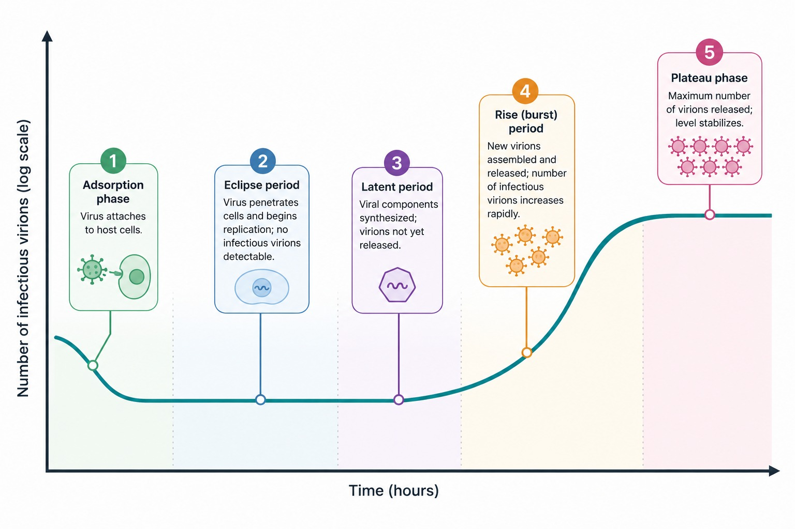

### Theory

The virus growth curve experiment is performed to study the replication pattern of a virus inside a host cell over a period of time. Since viruses are obligate intracellular parasites, they can multiply only inside living cells. This experiment helps in understanding the different stages of viral replication and the time required for the production of new viral particles.

The one-step growth curve was first described by Max Delbrück and Emory Ellis while working with bacteriophages infecting bacteria. In this method, all host cells are infected simultaneously by using a high multiplicity of infection (MOI). Because infection occurs at the same time in all cells, the replication process proceeds synchronously, allowing clear observation of different phases.

The virus growth curve typically shows the following phases:
1. **Adsorption phase** – The virus attaches to specific receptors on the host cell surface.
2. **Eclipse period** – After penetration, the viral particle disassembles. No infectious virus particles are detected during this stage because new virions have not yet been assembled.
3. **Latent period** – Viral components are synthesized and assembled inside the host cell. Infectious virus particles are still not released outside the cell.
4. **Rise (burst) period** – Host cells lyse and release newly formed virions into the surrounding medium.
5. **Plateau phase** – The number of infectious virus particles becomes constant because most host cells have already been lysed.

The number of infectious viral particles is measured by a plaque assay and expressed as plaque-forming units per milliliter (PFU/mL). When viral titer is plotted against time, a characteristic growth curve is obtained.

### Principle

The principle of the one-step growth curve experiment is based on synchronized infection of host cells and periodic measurement of viral titer.

A high MOI is used to ensure that nearly all host cells are infected at the same time. After allowing adsorption, unadsorbed viruses are removed so that only the initially infected cells contribute to virus production. Samples are collected at regular time intervals and assayed for infectious virus particles using a plaque assay.

By plotting the viral titer (\(\log \text{PFU/mL}\)) against time, the eclipse period, latent period, rise period, and burst size (average number of viruses produced per infected cell) can be determined.